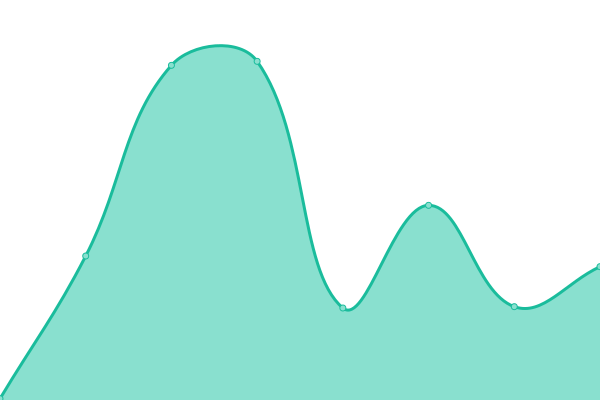
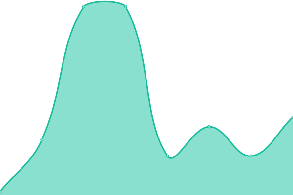

# [📈 Live Status](https://status.hershey.co): <!--live status--> **🟩 All systems operational**

This repository contains the open-source uptime monitor and status page for [Marc Hershey](https://marc.hershey.co), powered by [Upptime](https://github.com/upptime/upptime).

With [Upptime](https://upptime.js.org), you can get your own unlimited and free uptime monitor and status page, powered entirely by a GitHub repository. We use [Issues](https://github.com/marchershey/hersheynet-status/issues) as incident reports, [Actions](https://github.com/marchershey/hersheynet-status/actions) as uptime monitors, and [Pages](https://status.hershey.co) for the status page.

<!--start: status pages-->
<!-- This summary is generated by Upptime (https://github.com/upptime/upptime) -->
<!-- Do not edit this manually, your changes will be overwritten -->
<!-- prettier-ignore -->
| URL | Status | History | Response Time | Uptime |
| --- | ------ | ------- | ------------- | ------ |
|  [Production Server](45.32.212.135) | 🟩 Up | [production-server.yml](https://github.com/marchershey/hersheynet-status/commits/HEAD/history/production-server.yml) | 

 103ms
     
 | 

<a href="https://status.hershey.co/history/production-server">98.89%</a>
    

|  [Web Server](https://web.hershey.co) | 🟩 Up | [web-server.yml](https://github.com/marchershey/hersheynet-status/commits/HEAD/history/web-server.yml) | 

 177ms
     
 | 

<a href="https://status.hershey.co/history/web-server">100.00%</a>
    

|  [NS1 (ns1.hershey.co)](155.138.230.28) | 🟩 Up | [ns-1-ns1-hershey-co.yml](https://github.com/marchershey/hersheynet-status/commits/HEAD/history/ns-1-ns1-hershey-co.yml) | 

 36ms
     
 | 

<a href="https://status.hershey.co/history/ns-1-ns1-hershey-co">100.00%</a>
    

|  [NS2 (ns2.hershey.co)](45.32.223.202) | 🟩 Up | [ns-2-ns2-hershey-co.yml](https://github.com/marchershey/hersheynet-status/commits/HEAD/history/ns-2-ns2-hershey-co.yml) | 

 36ms
     
 | 

<a href="https://status.hershey.co/history/ns-2-ns2-hershey-co">100.00%</a>
    

|  [Hershey Home](https://home.hershey.co) | 🟩 Up | [hershey-home.yml](https://github.com/marchershey/hersheynet-status/commits/HEAD/history/hershey-home.yml) | 

 557ms
     
 | 

<a href="https://status.hershey.co/history/hershey-home">100.00%</a>
    

<!--end: status pages-->

[**Visit our status website →**](https://status.hershey.co)

## 📄 License

- Powered by: [Upptime](https://github.com/upptime/upptime)
- Code: [MIT](./LICENSE) © [Marc Hershey](https://marc.hershey.co)
- Data in the `./history` directory: [Open Database License](https://opendatacommons.org/licenses/odbl/1-0/)
